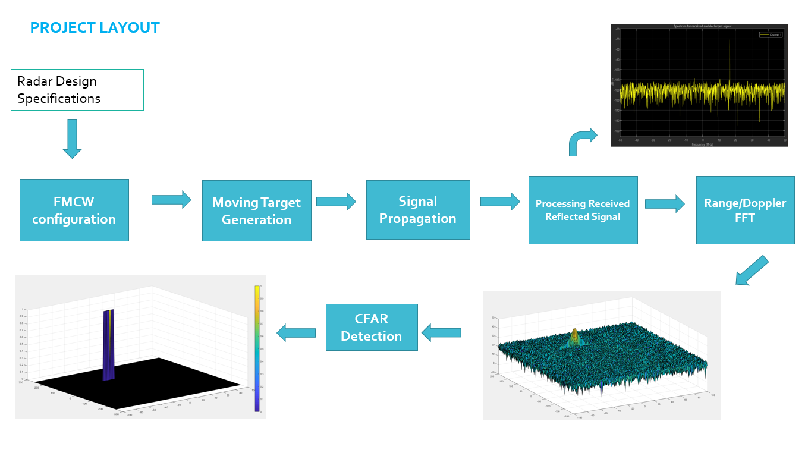
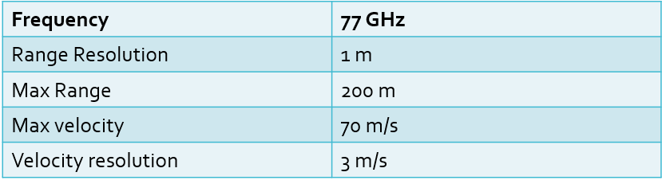
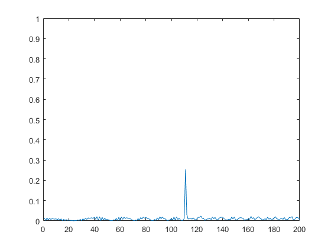
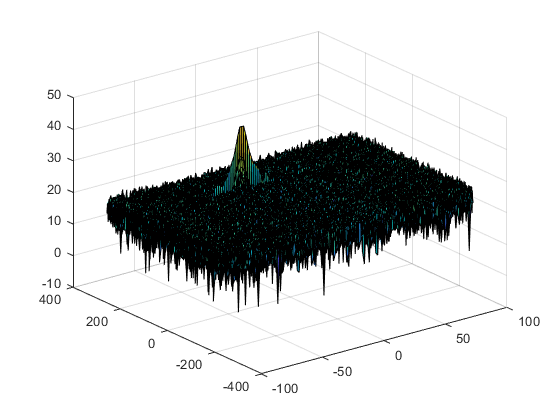
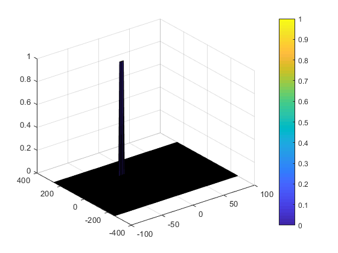

# A Radar Simulator

This repo primarily covers a step-by-step approach to generating synthetic radar targets and applying 2D CFAR detection -- exploring how radar sees the world. The simulation pipeline consists of the following, implemented in [Matlab](https://matlab.mathworks.com/).
1. Implementation steps for the 2D CFAR process.
2. Selection of Training, Guard cells and offset.
3. Steps taken to suppress the non-thresholded cells at the edges.


## Table of Content
- [Simulation Pipeline](#pipeline)
- [Radar System Requirements](#requirements)
- [Implementation Steps for 2D CFAR Process](#implementation)
- [Radar System Evaluation](#eval)
- [Acknowledgements](#acknowledgements)


## Simulation Pipeline <a name="pipeline"></a>
<p align="center"></p>

1. Configure the FMCW waveform based on the system requirements.
2. Define the range and velocity of target and simulate its displacement.
3. For the same simulation loop process the transmit and receive signal to determine the beat signal
4. Perform Range FFT on the received signal to determine the Range
5. Towards the end, perform the CFAR processing on the output of 2nd FFT to display the target.


## System Requirements <a name="requirements"></a>
System Requirements defines the design of a Radar. The sensor fusion design for different driving scenarios requires different system configurations from a radar. In this project, we follow the following system requirements to design our radar.
<p align="center"></p>

The sweep bandwidth can be determined according to the range resolution and the sweep slope is calculated using both sweep bandwidth and sweep time.
```matlab
bandwidth(B_sweep) = speed_of_light / (2 * range_resolution)
```

The sweep time can be computed based on the time needed for the signal to travel the unambiguous maximum range. In general, for an FMCW radar system, the sweep time should be at least 5 to 6 times the round trip time. This example uses a factor of 5.5.
```matlab
T_chirp = 5.5 * 2 * R_max / c
slope = bandwidth / T_chirp  % slope of chirp signal
```
For the initial selection of target range and velocity: the range cannot exceed the max value of 200m and velocity can be any value in the range of -70 to + 70 m/s.


## Implementation Steps for 2D CFAR Process <a name="implementation"></a>
Full implementation can be found on [radar-target-generation-and-detection.m](src/radar-target-generation-and-detection.m).

1. Radar specifications

   ```matlab
   %% Radar Specifications 
   %%%%%%%%%%%%%%%%%%%%%%%%%%%
   % Frequency of operation = 77GHz
   % Max Range = 200m
   % Range Resolution = 1 m
   % Max Velocity = 100 m/s
   %%%%%%%%%%%%%%%%%%%%%%%%%%%
   
   max_range = 200;  % in meters
   c = 3e8;  % speed of light in mps
   range_resolution = 1;  % in meters
   
   %Operating carrier frequency of Radar 
   fc = 77e9;  %carrier freq
   ```

2. Target specifications

   ```matlab
   %% User Defined Range and Velocity of target
   % *%TODO* :
   % define the target's initial position and velocity. Note : Velocity
   % remains contant
   target_pos = 110;  % in meters
   target_speed = -20;  % in mps
   ```

3. FMCW Waveform Generation

   In this project, we will designing a Radar based on the given system requirements (above).

   Max Range and Range Resolution will be considered here for waveform design.

   ```matlab
   % *%TODO* :
   %Design the FMCW waveform by giving the specs of each of its parameters.
   % Calculate the Bandwidth (B), Chirp Time (Tchirp) and Slope (slope) of the FMCW
   % chirp using the requirements above.
   
    B_sweep = c / (2 * range_resolution);  % calculate the Bandwidth (B)
    T_chirp = 5.5 * 2 * max_range / c;
    slope = B_sweep / T_chirp;
   ```

   Then, we need  simulate the signal propagation and move target scenario.

   

   ```matlab
   %% Signal generation and Moving Target simulation
   % Running the radar scenario over the time. 
   
   for i=1:length(t)         
       
       
        % *%TODO* :
        %For each time stamp update the Range of the Target for constant velocity. 
        r_t(i) = target_pos + (target_speed * t(i));
        td(i) = 2 * r_t(i) / c;  % time delay 
       
        % *%TODO* :
        %For each time sample we need update the transmitted and
        %received signal. 
        Tx(i) = cos(2 * pi * (fc * t(i) + slope * (t(i)^2)/2));
        Rx(i) = cos(2 * pi * (fc * (t(i) - td(i)) + slope * ((t(i)-td(i))^2)/2));
        
        % *%TODO* :
        %Now by mixing the Transmit and Receive generate the beat signal
        %This is done by element wise matrix multiplication of Transmit and
        %Receiver Signal
        Mix(i) = Tx(i) .* Rx(i);
       
   end
   ```

4. Range measurements

   The 1st FFT output for the target located at 100 meters

    * Reshape the vector into Nr*Nd array. 
    * Nr and Nd here would also define the size of Range and Doppler FFT respectively.
    ```
    Mix = reshape(Mix,[Nr,Nd]);
    ```
    * run the FFT on the beat signal along the range bins dimension (Nr) and
    ```
    sig_fft1 = fft(Mix,Nr);  
    ```
    * normalize.
    ```
    sig_fft1 = sig_fft1./Nr;
    ```
    * Take the absolute value of FFT output
    ```
    sig_fft1 = abs(sig_fft1);  
    ```
    * Output of FFT is double sided signal, but we are interested in only one side of the spectrum.
    * Hence we throw out half of the samples.
    ```
    single_side_sig_fft1 = sig_fft1(1:Nr/2);
    ```
    * Plotting the range, plot FFT output 
    ```
    figure ('Name','Range from First FFT')
    plot(single_side_sig_fft1); 
    axis ([0 200 0 1]);
    ```
    * Simulation Result
    <p align="center"></p>


5. Range and Doppler measurements

   2st FFT will generate a Range Doppler Map as seen in the image below and it will be given by variable ‘RDM’. 
    ```matlab
    % Range Doppler Map Generation.

    % The output of the 2D FFT is an image that has reponse in the range and
    % doppler FFT bins. So, it is important to convert the axis from bin sizes
    % to range and doppler based on their Max values.

    Mix=reshape(Mix,[Nr,Nd]);

    % 2D FFT using the FFT size for both dimensions.
    sig_fft2 = fft2(Mix,Nr,Nd);

    % Taking just one side of signal from Range dimension.
    sig_fft2 = sig_fft2(1:Nr/2,1:Nd);
    sig_fft2 = fftshift (sig_fft2);
    RDM = abs(sig_fft2);
    RDM = 10*log10(RDM) ;

    %use the surf function to plot the output of 2DFFT and to show axis in both
    %dimensions
    doppler_axis = linspace(-100,100,Nd);
    range_axis = linspace(-200,200,Nr/2)*((Nr/2)/400);
    figure,surf(doppler_axis,range_axis,RDM);
    ```
    * Simulation Result
    <p align="center"></p>


6. CFAR implementation

   The 2D CFAR is similar to 1D CFAR, but is implemented in both dimensions of the range doppler block. The 2D CA-CFAR implementation involves the training cells occupying the cells surrounding the cell under test with a guard grid in between to prevent the impact of a target signal on the noise estimate.
   ```matlab
    % *%TODO* :
    % Take the absolute value of FFT output
    sig_fft1 = abs(sig_fft1); 
   ```


   6.1. Select the number of Training Cells and Guard Cells in both the dimensions and set offset of threshold

      ```matlab
      % *%TODO* :
      %Select the number of Training Cells in both the dimensions.
      Tr = 10;
      Td = 8;
      
      % *%TODO* :
      %Select the number of Guard Cells in both dimensions around the Cell under 
      %test (CUT) for accurate estimation
      Gr = 4;
      Gd = 4;
      
      % *%TODO* :
      % offset the threshold by SNR value in dB
      off_set = 1.4;
      ```

   6.2. Slide Window through the complete Range Doppler Map

        ```matlab
        % *%TODO* :
        %design a loop such that it slides the CUT across range doppler map by
        %giving margins at the edges for Training and Guard Cells.
        %For every iteration sum the signal level within all the training
        %cells. To sum convert the value from logarithmic to linear using db2pow
        %function. Average the summed values for all of the training
        %cells used. After averaging convert it back to logarithimic using pow2db.
        %Further add the offset to it to determine the threshold. Next, compare the
        %signal under CUT with this threshold. If the CUT level > threshold assign
        %it a value of 1, else equate it to 0.
        
        
        % Use RDM[x,y] as the matrix from the output of 2D FFT for implementing
        % CFAR
        
        RDM = RDM/max(max(RDM)); % Normalizing
        
        % *%TODO* :
        % The process above will generate a thresholded block, which is smaller 
        %than the Range Doppler Map as the CUT cannot be located at the edges of
        %matrix. Hence,few cells will not be thresholded. To keep the map size same
        % set those values to 0. 
        
        %Slide the cell under test across the complete martix,to note: start point
        %Tr+Td+1 and Td+Gd+1

        for i = Tr+Gr+1:(Nr/2)-(Tr+Gr)
            for j = Td+Gd+1:(Nd)-(Td+Gd)
                %Create a vector to store noise_level for each iteration on training cells
                noise_level = zeros(1,1);
                %Step through each of bins and the surroundings of the CUT
                for p = i-(Tr+Gr) : i+(Tr+Gr)
                    for q = j-(Td+Gd) : j+(Td+Gd)
                        %Exclude the Guard cells and CUT cells
                        if (abs(i-p) > Gr || abs(j-q) > Gd)
                            %Convert db to power
                            noise_level = noise_level + db2pow(RDM(p,q));
                        end
                    end
                end
                
                %Calculate threshould from noise average then add the offset
                threshold = pow2db(noise_level/(2*(Td+Gd+1)*2*(Tr+Gr+1)-(Gr*Gd)-1));
                %Add the SNR to the threshold
                threshold = threshold + off_set;
                %Measure the signal in Cell Under Test(CUT) and compare against
                CUT = RDM(i,j);
                
                if (CUT < threshold)
                    RDM(i,j) = 0;
                else
                    RDM(i,j) = 1;
                end
                
            end
        end
        
        RDM(RDM~=0 & RDM~=1) = 0;
        ```

    The output of the 2D CFAR process，a peak and spread centered at 100m in range direction and 30 m/s in the doppler direction.

    <p align="center"></p>


## System Evaluation <a name="eval"></a>
In conclusion, we were able to use the given system requirements to design a FMCW waveform. That is, to find its Bandwidth (B), chirp time (Tchirp) and slope of the chirp. Our calculated slope was determined to be ~2e13.

We also got to simulate target movement and calculate the beat or mixed signal for every timestamp. A beat signal was generated such that once range FFT implemented, it gives our expected range--the initial position of target had an error margin of +/- 10 meters.

We implemented the Range FFT on the Beat or Mixed Signal and plot the result.It correctly generated a peak at the correct range, i.e the initial position of target also had an error margin of +/- 10 meters.

We also implemented the 2D CFAR process on the output of 2D FFT operation, i.e the Range Doppler Map. The 2D CFAR processing was able to suppress the noise and separate the target signal. The output then matched the image below.


## Ackowledgements <a name="acknowledgements"></a>
* [Udacity Sensor Fusion Program](https://learn.udacity.com/nanodegrees/nd313/parts/cd0683/lessons/b7907bc7-58e1-430a-ad51-a1f3e554b4dc/concepts/b7907bc7-58e1-430a-ad51-a1f3e554b4dc-project-rubric)

This project has also been shared on Medium ([see article here](https://medium.com/codex/building-a-radar-simulator-a-practical-guide-to-doppler-motion-and-2d-cfar-detection-17508fdf627b)). For any questions or feedback, feel free to email [moorissa.tjokro@columbia.edu](mailto:moorissa.tjokro@columbia.edu).
